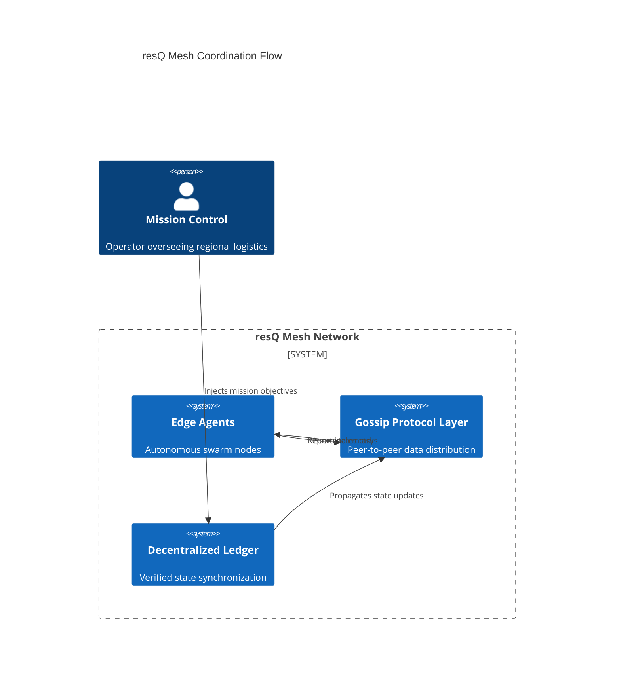

# resQ

A mission-critical decentralized platform for autonomous systems coordination in disaster response and emergency logistics.


## Overview

The resQ platform provides the foundational middleware for coordinating heterogeneous autonomous systems in high-stakes, disconnected environments. By leveraging decentralized consensus and edge-first architecture, resQ ensures that emergency logistics remain coordinated even when primary cloud connectivity is severed.

Whether managing a swarm of UAVs, ground-based sensor arrays, or humanitarian resource tracking, resQ offers the verified state synchronization needed for reliable field operations.

## Features

- **Decentralized Coordination:** Consensus-driven task allocation without a central point of failure.
- **Resilient Networking:** Protocol-agnostic mesh communication optimized for high-latency/intermittent links.
- **Mission-Critical Security:** Cryptographically verified command streams and hardware-rooted identity.
- **Autonomous Swarm Logic:** Built-in primitives for group behavior, obstacle avoidance, and path-finding.
- **Observability:** Real-time telemetry streaming compatible with standard GIS and monitoring tools.

## Architecture

resQ utilizes a decentralized agent-based architecture where each node functions as an autonomous peer within the swarm.



## Installation

Install the resQ core library via npm:

```bash
npm install @resq/core
```

For edge deployments requiring native performance optimizations:

```bash
git clone https://github.com/resq-software/resq.git
cd resq
npm install
npm run build
```

## Quick Start

Initialize your first autonomous agent in under 5 minutes:

```typescript
import { Agent, MissionProfile } from '@resq/core';

const agent = new Agent({ id: 'drone-01', type: 'uav' });
const mission = new MissionProfile({ priority: 'high', region: 'sector-7' });

await agent.deploy(mission);
```

## Usage

### Querying Decentralized State
Fetch the current status of all assets in your immediate mesh network:

```typescript
import { MeshClient } from '@resq/core';

const client = new MeshClient();
const fleetStatus = await client.getSnapshot();

console.log(`Operational assets: ${fleetStatus.activeCount}`);
```

### Troubleshooting Mesh Connectivity
If nodes fail to sync:
1. Verify UDP port 9000 is open for gossip traffic.
2. Ensure the `MESH_ID` matches across all nodes.
3. Check `resq.log` for synchronization latency warnings; high values indicate network congestion.

## Configuration

Configuration is managed primarily via `config.yaml`. Environment variables can override these settings during runtime.

| Variable | Default | Description |
| :--- | :--- | :--- |
| `MESH_ID` | `global-mesh` | Unique identifier for your network segment |
| `SYNC_INTERVAL` | `1000` | Heartbeat frequency in ms |
| `ENCRYPTION_KEY` | `REQUIRED` | AES-256 key for payload security |

## API Reference

The resQ API is structured around four primary domains:
*   **Agent API:** Interfaces for lifecycle management (deploy, recall, status).
*   **Coordination API:** Primitives for swarm behavior and consensus-based tasking.
*   **Mesh API:** Low-level control for peer discovery and gossip-protocol tuning.
*   **Telemetry API:** WebSocket interface for live asset tracking.

## Development

To contribute to the core engine:

1. **Setup:** Fork the repository and create a feature branch. Install dependencies via `npm install`.
2. **Security Implementation:** All cryptographic primitives reside in `/lib/crypto`. New protocols must utilize `AES-256-GCM` with rotating hardware-backed keys.
3. **Linting:** Run `npm run lint` to ensure code style compliance.
4. **Testing:** All logic requires 90%+ code coverage. Run `npm test` to verify changes before submission.

## Contributing

We welcome contributions from the global developer community. 
- **Security Policy:** Report vulnerabilities to `security@resq.software`. Do not open public issues for security flaws.
- **Code of Conduct:** All participants must adhere to the [Contributor Covenant](https://www.contributor-covenant.org/version/2/1/code_of_conduct/).
- **Bug Reports:** Open an issue via the GitHub tracker.
- **Pull Requests:** Ensure all PRs are linked to a corresponding issue and include unit tests.

## License

Copyright 2026 ResQ. 
Licensed under the [Apache License, Version 2.0](LICENSE).