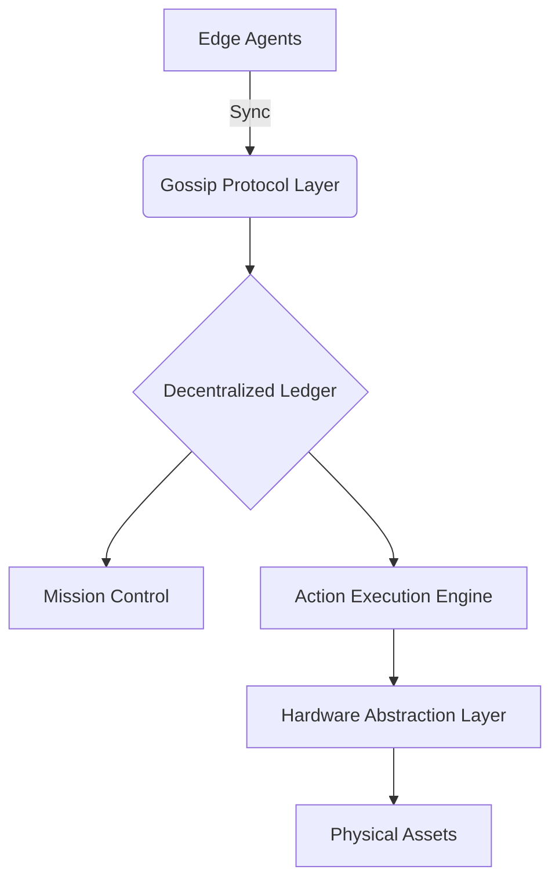

# resQ Developer Platform Documentation

<p align="center">
  
</p>

<p align="center">
  resQ is a mission-critical autonomous platform designed for decentralized coordination in disaster response and emergency logistics. We provide the resilient infrastructure required for autonomous systems to operate reliably when traditional networks and infrastructure fail.
</p>

<p align="center">
  <a href="./LICENSE">
    
  </a>
  <a href="https://github.com/resq-software">
    
  </a>
</p>

---

## Table of Contents
- [Overview](#overview)
- [Features](#features)
- [Architecture](#architecture)
- [Quick Start](#quick-start)
- [Usage Examples](#usage-examples)
- [Configuration](#configuration)
- [API Overview](#api-overview)
- [Development](#development)
- [Contributing](#contributing)
- [Roadmap](#roadmap)
- [License](#license)

---

## Overview

The resQ platform provides the foundational middleware for coordinating heterogeneous autonomous systems in high-stakes, disconnected environments. By leveraging decentralized consensus and edge-first architecture, resQ ensures that emergency logistics remain coordinated even when primary cloud connectivity is severed.

Whether managing a swarm of UAVs, ground-based sensor arrays, or humanitarian resource tracking, resQ offers the verified state synchronization needed for reliable field operations.

---

## Features

- **Decentralized Coordination:** Consensus-driven task allocation without a central point of failure.
- **Resilient Networking:** Protocol-agnostic mesh communication optimized for high-latency/intermittent links.
- **Mission-Critical Security:** Cryptographically verified command streams and hardware-rooted identity.
- **Autonomous Swarm Logic:** Built-in primitives for group behavior, obstacle avoidance, and path-finding.
- **Observability:** Real-time telemetry streaming compatible with standard GIS and monitoring tools.

---

## Architecture

resQ utilizes a decentralized agent-based architecture where each node functions as an autonomous peer within the swarm.



---

## Quick Start

Initialize your first autonomous agent in under 5 minutes:

```bash
# Clone the repository
git clone https://github.com/resq-software/resq.git

# Install dependencies
npm install

# Run the local development simulation
npm run dev:simulator
```

---

## Usage Examples

### 1. Registering a New Agent
Define an agent's mission parameters programmatically:

```typescript
import { Agent, MissionProfile } from '@resq/core';

const agent = new Agent({ id: 'drone-01', type: 'uav' });
const mission = new MissionProfile({ priority: 'high', region: 'sector-7' });

await agent.deploy(mission);
```

### 2. Querying Decentralized State
Fetch the current status of all assets in your immediate mesh network:

```typescript
import { MeshClient } from '@resq/core';

const client = new MeshClient();
const fleetStatus = await client.getSnapshot();

console.log(`Operational assets: ${fleetStatus.activeCount}`);
```

---

## Configuration

Configuration is managed via `config.yaml`. Essential parameters include:

| Variable | Description | Default |
| :--- | :--- | :--- |
| `MESH_ID` | Unique identifier for your network segment | `global-mesh` |
| `SYNC_INTERVAL` | Heartbeat frequency in ms | `1000` |
| `ENCRYPTION_KEY` | AES-256 key for payload security | `REQUIRED` |

---

## API Overview

The resQ API is structured around four primary domains:
*   **Agent API:** Interfaces for lifecycle management (deploy, recall, status).
*   **Coordination API:** Primitives for swarm behavior and consensus-based tasking.
*   **Mesh API:** Low-level control for peer discovery and gossip-protocol tuning.
*   **Telemetry API:** WebSocket interface for live asset tracking.

---

## Development

To contribute to the core engine:

1.  **Fork the repo** and create a feature branch.
2.  **Linting:** We use standard linting rules; run `npm run lint` before committing.
3.  **Testing:** All logic requires 90%+ code coverage. Run `npm test` to verify.
4.  **Documentation:** Update the `README.template.md` if adding a new module.

---

## Contributing

We welcome contributions from the global developer community. 
- **Bug Reports:** Open an issue via the GitHub tracker.
- **Feature Requests:** Use the "Proposal" label in the discussion section.
- **Pull Requests:** Ensure all PRs are linked to a corresponding issue and include unit tests.

---

## Roadmap

- **Q2 2026:** Launch of the decentralized consensus v2.0 (faster convergence).
- **Q3 2026:** Integration with standard NATO-standard communication protocols.
- **Q4 2026:** Hardened hardware reference designs for ruggedized field hardware.

---

## License

Copyright 2026 ResQ. 
Licensed under the [Apache License, Version 2.0](LICENSE).