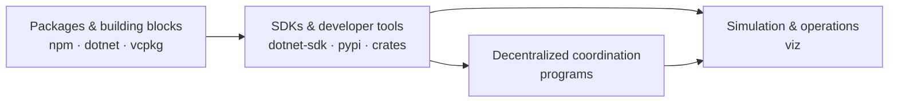

<div align="center">
  
  <h1>ResQ Systems</h1>
  <p><strong>Software for autonomous disaster response.</strong></p>
  <p>Resilient coordination, simulation, and operator tooling for autonomous systems working through degraded networks and infrastructure.</p>

  [](https://get.resq.software)
  [](https://viz.resq.software)
  [](https://docs.resq.software)
  [](https://research.resq.software)
  [](https://github.com/resq-software/.github/blob/main/LICENSE)
</div>

## Start building

Bootstrap a reproducible RESQ development environment:

```bash
curl -fsSL https://get.resq.software | sh
```

The onboarding flow authenticates with GitHub, installs a pinned Nix toolchain, lets you choose a repository, enters its development environment, and configures the `resq` CLI and canonical git hooks.

`get.resq.software` serves pinned, SHA-256-verified artifacts and exposes immutable version routes for provisioning. Those checks protect the GitHub-to-Worker delivery path and detect corrupted downloads; they are not an independent signature or proof of origin. See [`resq-software/dev`](https://github.com/resq-software/dev) for version pinning, unattended setup, digest verification, and the complete trust model.

## Explore the system

<table>
  <tr>
    <td width="25%" valign="top">
      <a href="https://research.resq.software"><strong>Research</strong></a><br>
      Working papers, technical notes, and field reports on emergency-response software.
    </td>
    <td width="25%" valign="top">
      <a href="https://viz.resq.software"><strong>Viz</strong></a><br>
      Live 3D common operating picture for simulated multi-agency autonomous response.
    </td>
    <td width="25%" valign="top">
      <a href="https://docs.resq.software"><strong>Docs</strong></a><br>
      Operations manual, platform concepts, integration guides, and API references.
    </td>
    <td width="25%" valign="top">
      <a href="https://design.resq.software"><strong>Design</strong></a><br>
      Component library and engineering design system used across RESQ interfaces.
    </td>
  </tr>
</table>

## Platform map



## Public repositories

### Experience

| Repository | What it provides | Stack |
| :--- | :--- | :--- |
| [`viz`](https://github.com/resq-software/viz) | Live 3D coordination view with mesh topology, hazard fusion, telemetry, and multi-agency simulation | TypeScript, Three.js, .NET |
| [`npm`](https://github.com/resq-software/npm) | Shared UI, mapping, telemetry, security, analytics, and foundational TypeScript packages | TypeScript, React |
| [`docs`](https://github.com/resq-software/docs) | Official operations, platform, integration, and API documentation | MDX, Mintlify |

### SDKs

| Repository | What it provides | Stack |
| :--- | :--- | :--- |
| [`dotnet-sdk`](https://github.com/resq-software/dotnet-sdk) | Typed clients, protocol contracts, blockchain anchoring, and simulation harnesses | C#, Protobuf |
| [`pypi`](https://github.com/resq-software/pypi) | FastMCP server exposing digital-twin, drone-coordination, and incident-response capabilities to AI clients | Python, FastMCP |

### Runtime

| Repository | What it provides | Stack |
| :--- | :--- | :--- |
| [`crates`](https://github.com/resq-software/crates) | The `resq` CLI/TUI workspace for repository automation, diagnostics, deployment, and operations | Rust |
| [`programs`](https://github.com/resq-software/programs) | On-chain programs for decentralized airspace management and autonomous delivery coordination | Rust, Solana Anchor |

### Foundation

| Repository | What it provides | Stack |
| :--- | :--- | :--- |
| [`dotnet`](https://github.com/resq-software/dotnet) | Reusable building blocks for Clean and Hexagonal .NET architectures | C# |
| [`vcpkg`](https://github.com/resq-software/vcpkg) | C++ libraries and foundational data structures for robotics software | C++17, CMake |
| [`dev`](https://github.com/resq-software/dev) | Reproducible developer onboarding, pinned installers, and canonical repository hooks | Shell, PowerShell, Nix |

## Contribute

Start with the repository's `AGENTS.md` for its architecture and local commands, then read the organization-wide [contribution guide](https://github.com/resq-software/.github/blob/main/CONTRIBUTING.md) and [engineering standards](https://github.com/resq-software/.github/tree/main/docs/standards). Security reports follow the [coordinated disclosure policy](https://github.com/resq-software/.github/blob/main/SECURITY.md).

Questions about the platform or an integration? Contact [contact@resq.software](mailto:contact@resq.software).

Copyright 2026 ResQ Systems, Inc. Public RESQ projects are individually licensed; organization defaults are available under [Apache License 2.0](https://github.com/resq-software/.github/blob/main/LICENSE).
